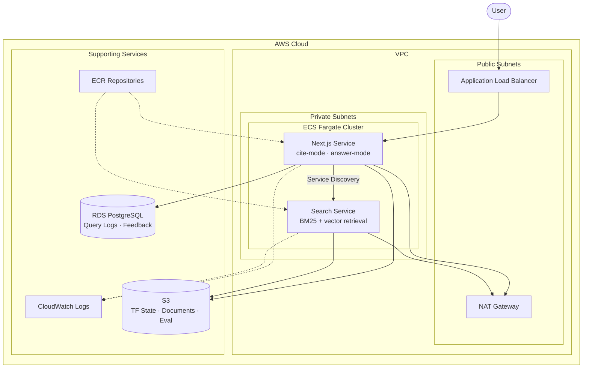

# AskWRI

A production-ready Next.js + Python application deployed to AWS ECS Fargate with Terraform and GitHub Actions. The Next.js frontend provides cite-mode and answer-mode search interfaces, while the Python search service handles BM25 + vector retrieval with query expansion.

## 🏗️ Architecture



## 📁 Project Structure

```
.
├── .github/workflows/
│   ├── deploy-qa.yml               # QA deployment workflow
│   ├── deploy-production.yml       # Production deployment workflow
│   ├── pr-check.yml                # Pull request validation
│   └── destroy.yml                 # Infrastructure teardown
├── docs/plans/                     # Design & implementation docs
├── evaluation/                     # Retrieval & synthesis eval framework
│   ├── run-answer-retrieval-eval.ts
│   ├── run-answer-synthesis-capture.ts
│   ├── run-answer-synthesis-llm-eval.ts
│   ├── run-cite-eval.ts
│   ├── calibrate-answer-thresholds.ts
│   ├── calibrate-cite-thresholds.ts
│   ├── diagnostics/                # Eval diagnostic utilities
│   └── lib/                        # Shared eval helpers
├── search-service/                 # Python retrieval service
│   └── app/
│       ├── main.py                 # FastAPI entry (BM25 + vector)
│       ├── cache_system.py         # S3-backed caching
│       ├── config.py               # Service configuration
│       ├── query_expansion.py      # Query expansion logic
│       └── routers/                # API route handlers
├── src/
│   ├── app/                        # Next.js App Router
│   │   ├── api/                    # API routes
│   │   │   ├── answer/             # Answer-mode endpoints
│   │   │   ├── alignment/          # Alignment endpoints
│   │   │   ├── catalog/            # Catalog endpoints
│   │   │   ├── cite-mode-*/        # Cite-mode feedback & query logs
│   │   │   ├── answer-mode-*/      # Answer-mode feedback & query logs
│   │   │   ├── eval/               # Evaluation endpoints
│   │   │   ├── health/             # Health check
│   │   │   ├── relates/            # Related questions
│   │   │   └── why/                # Why endpoints
│   │   ├── components/             # React components
│   │   │   ├── AnswerMode/         # Answer-mode UI
│   │   │   ├── results/            # Results display
│   │   │   └── Footer/
│   │   ├── results/                # Results page (cite-mode)
│   │   └── utils/                  # Client utilities
│   ├── config/                     # App configuration
│   ├── db/                         # TypeORM database layer
│   │   ├── entities/               # DB entities (feedback, query logs)
│   │   ├── queries/                # Query helpers
│   │   └── migrations/             # Database migrations
│   └── lib/                        # Server-side libraries
│       ├── llamacloud.ts           # LlamaCloud integration
│       ├── llamaindex-client.ts    # LlamaIndex client
│       ├── multi-query-strategy.ts # Multi-query retrieval
│       ├── catalog-cache.ts        # Catalog caching
│       └── eval-storage.ts         # Eval data S3 storage
├── terraform/
│   ├── backend-setup/              # Terraform state backend
│   ├── infrastructure/             # Main infrastructure (VPC, ECS, ALB, etc.)
│   └── environments/               # Environment configs (qa, production)
├── Dockerfile                      # Next.js container
├── search-service/Dockerfile       # Search service container
└── package.json
```

## 🚀 Getting Started

### Prerequisites

- [Node.js](https://nodejs.org/) 20.x or later
- [Python](https://www.python.org/) 3.12.x or later
- [Docker](https://www.docker.com/)
- [Terraform](https://www.terraform.io/) 1.0+
- [AWS CLI](https://aws.amazon.com/cli/) configured with appropriate credentials
- [GitHub](https://github.com/) account

### 1. Clone and Install Dependencies

```bash
git clone <repository-url>
cd askwri-app
npm install
```

### 2. Set Up Terraform State Backend

Before deploying infrastructure, you need to create the S3 bucket and DynamoDB table for Terraform state:

```bash
cd terraform/backend-setup

# Make the script executable
chmod +x setup.sh

# Run setup (uses default values)
./setup.sh

# Or customize with environment variables
AWS_REGION=us-east-2 PROJECT_NAME=askwri-app ./setup.sh
```

### 3. Configure GitHub Repository

1. Create a new GitHub repository
2. Push this code to the repository
3. Create the following branches:
   - `main` or `production` - Production deployments
   - `qa` - QA deployments

4. Add GitHub variables for AWS permissions (Settings → Secrets and variables → Actions -> Variables):
   - `OIDC_ROLE` - ARN from AWS console for role GitHubActionsOIDC

### 4. Required AWS IAM Permissions

The AWS credentials need permissions for:
- ECR (create/push images)
- ECS (manage clusters, services, tasks)
- EC2 (VPC, subnets, security groups, NAT gateways)
- ELB (Application Load Balancers)
- IAM (create roles and policies)
- CloudWatch (logs)
- S3 (Terraform state)
- DynamoDB (Terraform locks)

### 5. Deploy

Push to the appropriate branch to trigger deployment:

```bash
# Deploy to QA
git checkout -b qa
git push origin qa

# Deploy to Production
git checkout main
git push origin main
```

## 🔧 Local Development

```bash
# Install dependencies
npm install

# Run development server
npm run dev

# Run tests
npm test

# Build for production
npm run build

# Start production server
npm start
```

### Docker Build

```bash
# Build image
docker build -t askwri-app .

# Run container
docker run -p 3000:3000 askwri-app
```

## 📋 Environment Configuration

### QA Environment
- VPC CIDR: `10.0.0.0/16`
- Resources (nextJS): 256 CPU / 512 MB Memory
- Resources (python): 1024 CPU / 4096 MB Memory
- Desired count: 1 task
- Auto-scaling: 1-2 tasks (disabled)

### Production Environment
- VPC CIDR: `10.1.0.0/16`
- Resources (nextJS): 512 CPU / 1024 MB Memory
- Resources (python): 1024 CPU / 4096 MB Memory
- Desired count: 1 tasks
- Auto-scaling: 1-10 tasks (disabled)

## 🔄 CI/CD Workflows

| Workflow | Trigger | Description |
|----------|---------|-------------|
| `deploy-qa.yml` | Push to `qa` branch | Deploy to QA environment |
| `deploy-production.yml` | Push to `main`/`production` | Deploy to Production |
| `pr-check.yml` | Pull requests | Run tests and validate |
| `destroy.yml` | Manual | Tear down infrastructure |

## 🗑️ Teardown

### Destroy Infrastructure (via GitHub Actions)

1. Go to Actions → Destroy Infrastructure
2. Select the environment (qa or production)
3. Type `DESTROY` to confirm
4. Run workflow

### Destroy Terraform State Backend

```bash
cd terraform/backend-setup
chmod +x teardown.sh
./teardown.sh
```

⚠️ **Warning**: This will permanently delete all Terraform state files!

## Process for updating KPs (Knowledge products)
Note this assumes that documents.csv has already been generated and list of documents has also been compiled.
- Update /tmp/askWRI_docs directory with new documents.csv as well as new documents (may require some removals too)
- rm -rf /tmp/askWRI_cache/*
- Ensure local `.env` file contains the same contents as in AWS param store for search-service.  Also good to add ASKWRI_APP_ENV contents as well.
- In search-service directory:
  - `pip install -r requirements.txt`
  - `python -m uvicorn app.main:app`
    - This should rebuild the cache directory (/tmp/askWRI_cache)
    - This takes about half an hour or so for 170 documents
    - When finished, the python code will output `app.main - INFO - Background indexing complete`
- Test changes by running `npm run dev` from root directory
- Run following aws s3 sync commands.
  - Note: this requires you have proper AWS_PROFILE setup and have recently run `aws sso login`
  - Note: Following sync commands do not remove files, so any file removals should be done separately, or delete everything with `aws s3 rm --recursive s3://askwri-data/documents/`
  - `aws s3 sync /tmp/askWRI_docs s3://askwri-data/documents/`
  - `aws s3 rm --recursive s3://askwri-data/cache/`
  - `aws s3 sync /tmp/askWRI_cache s3://askwri-data/cache/`
- Restart services (both search service and app) to pick up new files from AWS S3 (either by deploying or via AWS Console ECS service)

## 📊 Monitoring

- **CloudWatch Logs (Next.js)**: `/ecs/askwri-app-{environment}`
- **CloudWatch Logs (Search Service)**: `/ecs/askwri-app-{environment}-search-service`
- **Container Insights**: Enabled on ECS cluster
- **Health Check (Next.js)**: `GET /api/health`
- **Service Discovery**: Internal DNS via `{service}.askwri-app-{environment}.local`

## 🔐 Security Features

- VPC with public/private subnet isolation
- NAT Gateways for private subnet internet access
- Security groups limiting traffic
- ECS managed tags propagated to ENIs and runtime resources
- S3 bucket versioning and encryption for Terraform state
- ECR image scanning on push
- Non-root container user
- HTTPS headers configured in Next.js

## 💰 Cost Optimization

- Use `FARGATE_SPOT` for non-production workloads
- Auto-scaling based on CPU/Memory utilization
- ECR lifecycle policies to clean old images
- Consider reducing NAT Gateway count for non-production

## 📝 Customization

### Adding Environment Variables

1. Update `terraform/environments/{env}.tfvars`:
```hcl
app_environment_variables = {
  "MY_VAR" = "my-value"
}
```

2. Redeploy

#### Secrets
Environment secrets for search service are stored in AWS Param Store and copied to github secrets.  Be sure to update both.  Param store key is 
`SEARCH_SERVICE_ENV` in JSON format.  Github secrets mirror the same key and are expected to be copy/pasted from the AWS Param Store.


### Changing Resources

Edit `terraform/environments/{env}.tfvars`:
```hcl
container_cpu    = 512   # 0.5 vCPU
container_memory = 1024  # 1 GB
desired_count    = 3
```

## 🆘 Troubleshooting

### Common Issues

1. **Deployment fails at ECS service stability**
   - Check CloudWatch logs
   - Verify health check endpoint returns 200
   - Check security group rules

2. **Terraform state lock error**
   - Wait for other deployments to complete
   - If stuck, manually release lock in DynamoDB

3. **Docker build fails**
   - Ensure all dependencies are in package.json
   - Check for missing files in .dockerignore

## 📄 License

MIT
